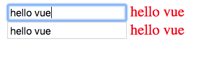

TypeScript Vue Use Plain Object as Store Demo
=============================================

我觉得vuex太复杂了，需要写太多重复代码，尤其是在typescript下，还很难利用类型系统。

所以我尝试了一下直接使用一个普通的object当作store，看是否可以。

答案是可以成功的更新。我们去掉了vuex带来的保护，但也获得了简单性。


```
npm install
npm run serve
```


